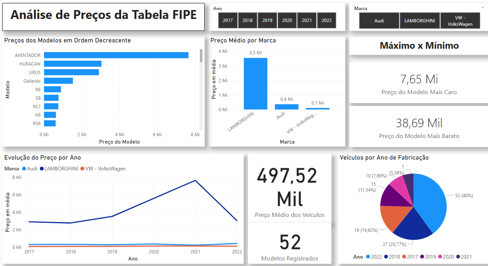

# 📊 Projeto de Análise de Dados com PySpark, Pandas e Power BI

Este repositório contém um projeto de **manipulação e análise de dados** utilizando **Python**, seguido pela criação de um **dashboard interativo no Power BI** para visualização dos resultados.

---

## ⚙️ Tecnologias Utilizadas

- [Python](https://www.python.org/)
- [Pandas](https://pandas.pydata.org/)
- [PySpark](https://spark.apache.org/docs/latest/api/python/)
- [Power BI](https://powerbi.microsoft.com/)

---

## 🎯 Objetivo

O objetivo deste projeto é manipular e analisar os dades referentes a preços da **Tabela FIPE**.

---

## 📊 Dashboard

[Visualizar Dashboard](https://cinufpe-my.sharepoint.com/:u:/g/personal/apsn_cin_ufpe_br/Efaj68RGG91OnQ1TfFHgZtwB4Mrvquv6TevFbXFLRlorZA?e=brAVzO)

O dashboard interativo foi criado com o **Power BI**, permitindo a navegação pelos principais insights obtidos na análise. Ele inclui:

- Gráficos de comparativo de preços
- Evolução de preços durante os anos
- Valor do veículo mais caro e mais barato

📁 O arquivo `Dashboard Tabela FIPE.pbix` está disponível no repositório e por este [link](https://cinufpe-my.sharepoint.com/:u:/g/personal/apsn_cin_ufpe_br/Efaj68RGG91OnQ1TfFHgZtwB4Mrvquv6TevFbXFLRlorZA?e=brAVzO).

## 🖼️ Prévia do Dashboard

Abaixo, uma prévia do dashboard criado no Power BI:

